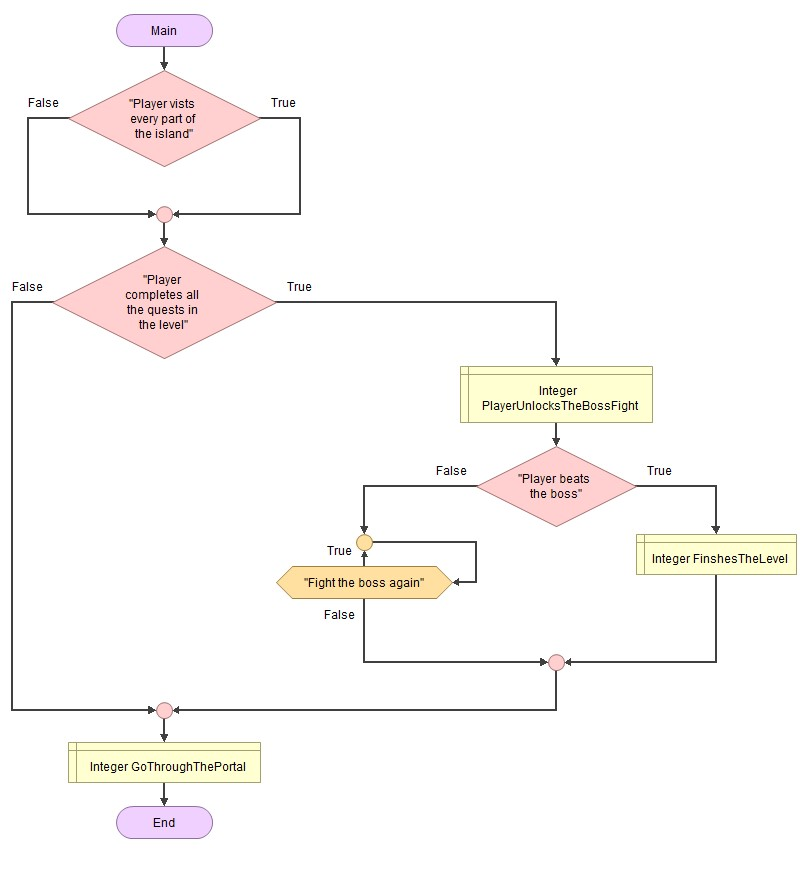
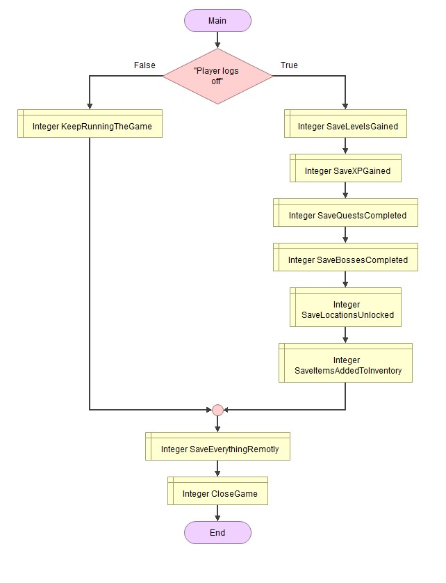

# Identifying and Defining
## Identifying a Need 
The game's main theme is a lost turtle who wants to travel the world and he needs to avoid cars, plastic, and predators, and he can collect souvenirs and make friends along the way. It will help teach kids about the pollution and other problems animals face will also make it interesting where they make friends and collect fun and cool items along the way as souvenirs this game will also teach them about friendship and include people to help stop bullying which occurs with children. This will be entertaining for children under 15, the game will be especailly useful for younger kids as it will teach them to take care of the planet and make friends with people and include people. Yet people of all ages can play this because of its simple controls and inspiring themes. There will also be daily and weekly quests to help give the kids a sense of accomplishment and can help them control the amount they play the game so that they don't they addicted and ruin their health as this is a major problem with children.   
## Requirements 
Inputs: W,A,S,D or arrow keys and a special control for doubling taping W, E, R, space bar, and mouse or cursor. The W,A,S,D, or arrow keys, will be used for  basic movement, E, and R keys will be used to open your inventory and drop items from it. The space bar will be used for jumping, The mouse or cursor will be used for many purposes like interacting with characters and interacting with items and more.   
Processing: each of these commands will help players move places and collect things interact with NPC's check the map, check their inventory, and drop or replace things from it, jump up and double taping the W key to let the player sprint for a limited time. 
Outputs: The screens will constantly display a mini-map, the player's score, quests, and XP. The screen will also display messages from NPC's  
Transmissions: The game will send the player's current level, XP gained, and other thing to an online leaderboard
Storage: The game should be saved locally and should save the player's location, inventory, and more.
# Functional Requirments
## User Interaction 
Users can interact using the W,A,S,D,  and arrow keys to move there will also be a "sprinting" mode which players can use to boost their speed for a short time and can do this by double tapping the W key. Players can also use the space bar to make their character jump. There will be two more special keys which are E for opening your inventory and R for dropping items from it. Finally, the mouse/cursor will be used to interact with NPCs, objects, and more
## Core Gameplay and Simulation Mechanics 
There will be, movement keys which are W,A,S,D, and arrow keys which will be used for traveling forward, backward, left, and right. Space bar for jumping, and doubling taping W for a speed boost, There's also a button to open your inventory which is E and R to drop items from it. Clicking your mouse and cursor will be used for various purposes like grabbing and moving items, interacting with NPC's, and more.
## Scoring and feedback
There will be 2 main scoring systems one is XP which you can get from logging in, discovering new places, and interacting with new objects.
## Level Progression or Simulation Stages
There will be multiple locations and bosses in every one of them and the only way to complete the level is to beat the boss you can't fight the boss until you complete quests 
## Saving and Loading Data 
The game will save all your different locations in the map you unlock it will also save your XP level and the data will be stored remotely 
# Non-Functional Requirments
## Performance Requirments 
The performance should be very smooth. It should have smooth controls and run smoothly or else people might switch games, the speed that it loads at is also important but not as much as the other two things.
## Usability Requirments
There will be NPCs to interact with which will help guide users in their quest and teach them extra controls to help them learn how to play the game.
## Compatibility Requirements
The game should run on a mobile, laptop, and PC and should be compatible with both Andriod and iOS 
## Scalibilty Requirments 
The game will add new areas to the map as the game continues to grow
## Security Requirements
Each player will have to create an account with a secure password to help protect their account
## Reliability and Availability 
The system should be online 24/7 so that people around the world anytime and play whenever they want
# Consideration of Social and ethical issues
## Define the following terms
## Accessibility
Accessibility is the practice of making your websites usable by as many people as possible. The practice of making sites accessible also benefits other groups such as those using mobile devices, or those with slow network connections.
## Equity
Equity can be defined as the amount of money the owner of an asset would be paid after selling it and any debts associated with the asset were paid off. 
## Acessibility
Consideration - My game should aim to be useable by lots of different people while there may be a few things that stop  people from playing most people should be able to play. Having the game be more accessible to different people is very good since it will allow the game to get more players and more people to be able to play my game if they can't play others.
Guidance - My game should have subtitles and will be able to give hints and directions if a player gets stuck in a certain part.
## Privacy and Data protection
Consideration - The game will store player data but this will only include, the player's XP and the player's locations unlocked. There will only be a very small amount of data stored so that in case of a hack the player doesn't lose much.  
Guidance - The player will have to allow they want there high scores to be public or stored otherwise they won't be and also the amount of the map they unlocked. This is important to have the player's consent so that if they don't want their score to be public we know.
## Fairness and Representation
Consideration - The game should not create any negative images, and since it mostly relates to wildlife it would not. Having negative stereotypes in your game is very disrespectful since it could negatively impact players causing them to feel sad.
Guidance - The game won't include harmful stereotypes or negative images the game won't have that many humans in it so that people don't get offended and also because it doesn't relate to the theme. 
## Cultural Sensitivities 
Consideration - The game will involve travel to different areas but won't negatively impact the area and the culture, the game will tend to stay away from human life so there wouldn't be many references to make
Guidance - There won't be any symbols or themes relating to any cultures or areas especially negative ones. The game will make sure to stay away from human life and won't delve into many cultures or their history of them.  
# PMI Table
| Name              | Positive | Negative | Implication |
| :---------------- | :------: | -------: | -------: |
| Spiderman 2       |    The idea of the game is very engaging it involves a popular superhero spiderman, The game can improve hand-eye coordination, motor skills,  and quick-thinking skills which are useful for younger kids. Spiderman 2 can help your memory as you need to remember where things are located in different parts of the city, | Spiderman 2 is one of the most popular games because of how addicting it is. Spiderman 2 is also too repetitive and similar to the first game The main plot wasn't very interesting and was finished too quickly  | The idea of having an explorable map is very interesting and something I would like to add to my game.  |
|         NBA2K   |   The game has multiple different modes, which help keep the game entertaining over a longer time. The game can help your memory. Your memory can be trained as you need to smoothly press different buttons to shoot, pass, set screens, run plays, block, steal, defend, sprint, and more. The in-game currency in NBA can be earned in other ways rather than buying with real money.   | The game gets replaced every year. Every year 2k releases the next version of NBA and shuts down the servers to an older version making it unplayable. This will cause kids to spend money on the new version, When they release a new version the preorders normally cost around 120$ which is very expensive, A lot of things in My Career cost money including packs and upgrading your player. | The idea to gain in-game currency without paying for it is good, this will help kids not spend more money on the game. |
| Brawlstars  |  The game gets constant updates making the game feel brand new and interesting. The progression system is very easy to understand, you have to get wins with brawlers and get more brawlers and gain more total trophies. The developers give the Brawl Stars community lots of events which can help people get a lot of free rewards.   | The game is very addicting, The game constantly makes updates and changes to make people play even more. The game makes a brawl pass.  This causes them to spend even more money on the game they are able to do this by showing the rewards they miss out on without a brawl pass. The game is very toxic. The developers constantly release toxic and negative pins, which can lead to online bullying. | Events. This is a fun way to cause the community to work together and unlock fun rewards, this will also help people progress in our game without spending money on the game. |

## Pseudo Code
### Begin Movement
### &nbsp; If W is double-tapped
### &nbsp; &nbsp; Then sprint 
### &nbsp; If W is pressed 
### &nbsp; &nbsp; Then move player forward
### &nbsp; Is S is Pressed
### &nbsp; &nbsp; Then move player back
### &nbsp;
### &nbsp;

## Flowgirthm
## User Interaction 

## Scoring and feedback

## Level Progression or Simulation Stages

## Saving and Loading Data 
<<<<<<< HEAD

# Gnatt Chart

