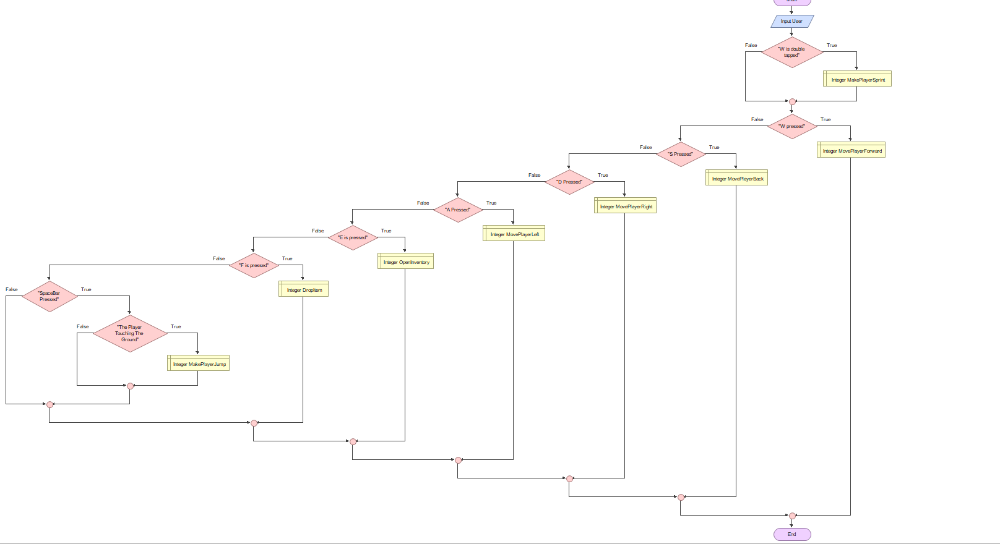
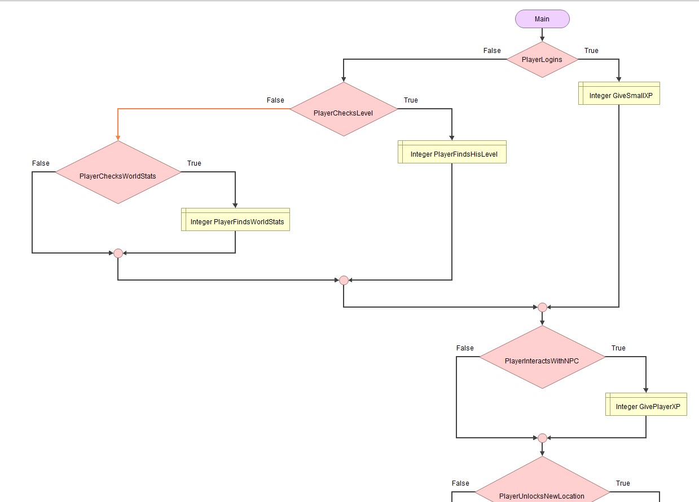
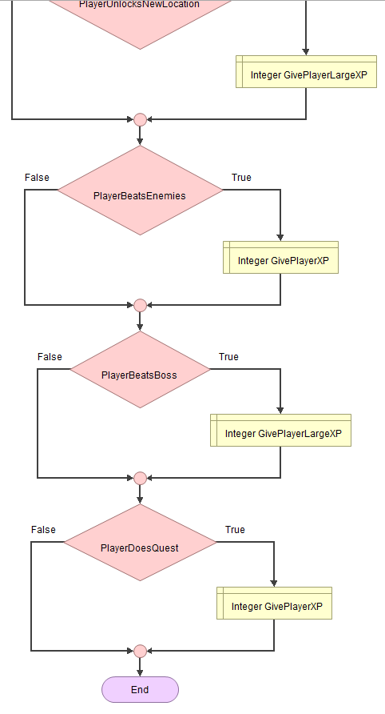

# Identifying and Defining
## Identifying a Need 
The game's main theme is a lost turtle who wants to travel the world and he needs to avoid cars, plastic, and predators, and he can collect souvenirs and make friends along the way. It will help teach kids about the pollution and other problems animals face will also make it interesting where they make friends and collect fun and cool items along the way as souvenirs this game will also teach them about friendship and include people to help stop bullying which occurs with children. This will be entertaining for children under 15, the game will be especailly useful for younger kids as it will teach them to take care of the planet and make friends with people and include people. Yet people of all ages can play this because of its simple controls and inspiring themes. There will also be daily and weekly quests to help give the kids a sense of accomplishment and can help them control the amount they play the game so that they don't they addicted and ruin their health as this is a major problem with children.   
## Requirements 
Inputs: W,A,S,D or arrow keys and a special control for doubling taping W, E, R, space bar, and mouse or cursor. The W,A,S,D, or arrow keys, will be used for  basic movement, E, and R keys will be used to open your inventory and drop items from it. The space bar will be used for jumping, The mouse or cursor will be used for many purposes like interacting with characters and interacting with items and more.   
Processing: each of these commands will help players move places and collect things interact with NPC's check the map, check their inventory, and drop or replace things from it, jump up and double taping the W key to let the player sprint for a limited time. 
Outputs: The screens will constantly display a mini-map, the player's score, quests, and XP. The screen will also display messages from NPC's  
Transmissions: The game will send the player's current level, XP gained, and other thing to an online leaderboard
Storage: The game should be saved locally and should save the player's location, inventory, and more.
# Functional Requirments
## User Interaction 
Users can interact using the W,A,S,D,  and arrow keys to move there will also be a "sprinting" mode which players can use to boost their speed for a short time and can do this by double tapping the W key. Players can also use the space bar to make their character jump. There will be two more special keys which are E for opening your inventory and R for dropping items from it. Finally, the mouse/cursor will be used to interact with NPCs, objects, and more
## Core Gameplay and Simulation Mechanics 
There will be, movement keys which are W,A,S,D, and arrow keys which will be used for traveling forward, backward, left, and right. Space bar for jumping, and doubling taping W for a speed boost, There's also a button to open your inventory which is E and R to drop items from it. Clicking your mouse and cursor will be used for various purposes like grabbing and moving items, interacting with NPC's, and more.
## Scoring and feedback
There will be 2 main scoring systems' one is XP which you can get from logging in, discovering new places, and interacting with new objects.
## Level Progression or Simulation Stages
There will be multiple locations and bosses in every one of them and the only way to complete the level is to beat the boss you can't fight the boss until you complete quests 
## Saving and Loading Data 
The game will save all your different locations in the map you unlock it will also save your XP level and the data will be stored remotely 
# Non-Functional Requirments
## Performance Requirments 
The performance should be very smooth. It should have smooth controls and run smoothly or else people might switch games, the speed that it loads at is also important but not as much as the other two things.
## Usability Requirments
There will be NPCs to interact with which will help guide users in their quest and teach them extra controls to help them learn how to play the game.
## Compatibility Requirements
The game should run on a mobile, laptop, and PC and should be compatible with both Andriod and iOS 
## Scalibilty Requirments 
The game will add new areas to the map as the game continues to grow
## Security Requirements
Each player will have to create an account with a secure password to help protect their account
## Reliability and Availability 
The system should be online 24/7 so that people around the world anytime and play whenever they want
# Consideration of Social and ethical issues
## Define the following terms
## Equity
Equity can be defined as the amount of money the owner of an asset would be paid after selling it and any debts associated with the asset were paid off. 
## Accessibility
Accessibility is the practice of making your websites usable by as many people as possible. The practice of making sites accessible also benefits other groups such as those using mobile devices, or those with slow network connections.
## PMI Table
| Name              | Positive | Negative | Implication |
| :---------------- | :------: | -------: | -------: |
| Spiderman 2       |    The idea of the game is very engaging it involves a popular superhero spiderman, and his villains which all appeal to kids between the ages of 10 - 18. The idea of boss fights and exploring the city and new places give kids a brand new and engaging experience

The game can improve hand-eye coordination, motor skills,  and quick-thinking skills which are useful for younger kids. This can be useful to them in the future as it helps with catching and throwing skills and the motor skills help overall physical development and balance, and quick thinking skills can be useful in sports. This can all be proven as games constantly require you to look and screen so you need to know where all the controls are. The motor skills can be proven as they require precise and smooth movement. Games help quick thinking skills as in boss fights you need to use your knowledge in the game to quickly find ways to beat the "boss"

Spiderman 2 can help your memory as you need to remember where things are located in different parts of the city, you also need to remember the different controls and combos to help win your fight. This can all prove the fact of how Spiderman 2 can help your memory.  |  | 23.99 |
|         NBA2K   |   True   | 23.99 | 23.99 |
| Brawlstars  |  False   | 19.99 | 23.99 |

## Pseudo Code
### Begin Movement
### &nbsp; If W is double tapped
### &nbsp; &nbsp; Then sprint 
### &nbsp; If W is pressed 
### &nbsp; &nbsp; Then move player forward
### &nbsp; Is S is Pressed
### &nbsp; &nbsp; Then move player back
### &nbsp;
### &nbsp;

## Flowgirthm

